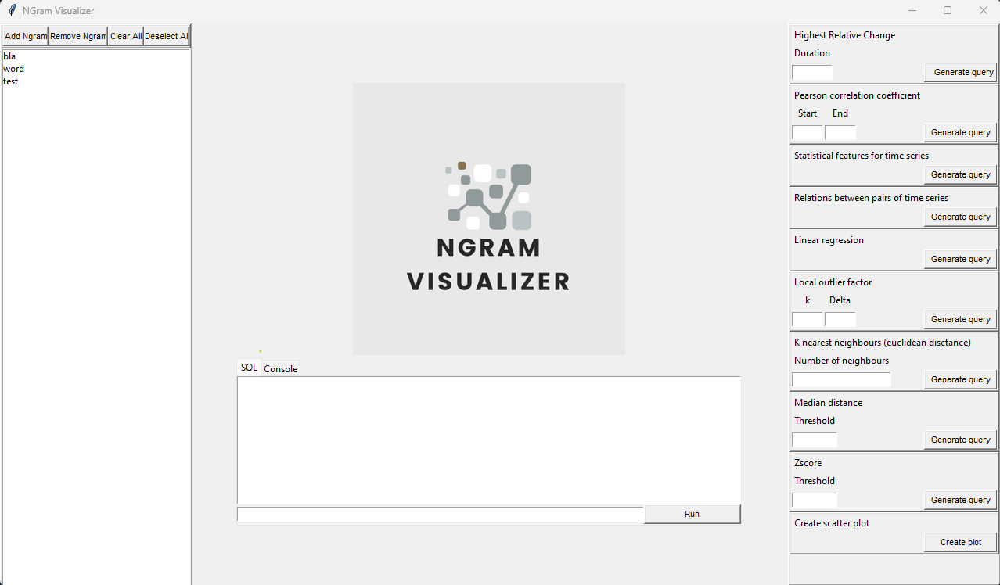

# group_4: NGRAM_ANALYZER

## Setup
- clone repo
- cd to ./group4
- init poetry environment ```poetry install```
- enter poetry environment ```python -m poetry shell```

## Interaction via CLI
- the following commands are run inside the poetry shell
- List command options: ```main.py -h```
- Create database: ```main.py --create-db --username username --password password --dbname database_name```
  - Alternatively, you can provide the path to a config file using the ```--config_path``` option
  - Each user can only create one database on the local machine
  - To create the database with a different name, manually delete your configuration file from the ./settings directory
      - look for config_your_username.ini
      - this will not delete the actual database
- Transfer data from ./data into the database: ```main.py --transfer path_to_data --username username --password password --dbname database_name```
  - You can specify a path to the data folder by using ```--data_path```. If not, the default path from the config file will be used
  - Alternatively, you can provide the path to a config file using the ```--config_path``` option
- Enter shell version of the CLI: ```main.py --shell``` oder ```main.py```

## Interaction via Shell
The following commands are available within the ngram_analyzer shell:
- ```help``` or ```?``` shows commands
- ```sql``` opens a sql shell
  -  Example usage for user defined functions:
    - Highest relative change
      ```sql
      select hrc.str_rep word, hrc.type type, hrc.start_year start, hrc.end_year end, hrc.result hrc from (select hrc(3, *) hrc from schema_f)
      ```
      - Calculates the strongest relative change between any two years that are duration years (3 in above example) apart
    - Pearson correlation coefficient of two time series
      ```sql
      select pc.str_rep_1 word_1, pc.type_1 type_1, pc.str_rep_2 word_2, pc.type_2 type_2, pc.start_year start, pc.end_year end, pc.result pearson_corr from (select pc(1990, 2000, *) pc from schema_f a cross join schema_f b where a.str_rep != b.str_rep)
      ```
      - Calculates the Pearson correlation coefficient of two time series (limited to the time period of [start year, end year])
    - Statistical features for time series
      ```sql
      select sf.str_rep, sf.type, sf.mean, sf.median, sf.q_25, sf.q_75, sf.var, sf.min, sf.max, sf.hrc from (select sf(*) sf from schema_f)
      ```
      - Calculates statistical features for time series from schema f
    - Relations between pairs of time series
      ```sql
      select rel.str_rep1, rel.type1, rel.str_rep2, rel.type2, rel.hrc_year, rel.hrc_max, rel.cov, rel.spearman_corr, rel.pearson_corr from (select rel(*) rel from schema_f a cross join schema_f b where a.str_rep != b.str_rep)
      ```
      - Calculates the relations between pairs of time series from schema fxf
    - linear regression for a given time series: 
      ```sql
      select lr.type type, lr.slope slope, lr.intercept intercept, lr.r_value r_value, lr.p_value p_value, lr.std_err std_err from (select lr(*) lr from schema_f limit 1)
      ```
      - Calculates the linear regression for a given time series from schema f
    - Local outlier factor
      ```sql
      select lof.outlier from (select lof(2,2,*) lof from (select * from schema_f where str_rep = "Archivarsverband") cross join (select * from schema_f where str_rep = "Akaza") cross join (select * from schema_f where str_rep = "Balantiopteryx") cross join (select * from schema_f where str_rep = "Ankömmlinge"))
      ```
    - Euclidean distance: calculate k nearest neighbours for a word (via NearestNeighbourPlugin): 
      ```sql
      select ed.str_rep, ed.result from (select euclidean_dist(*) ed from schema_f a cross join schema_f b where a.str_rep = 'word_of_interest' and b.str_rep != 'word_of_interest' limit 100) order by 2 limit k
      ```
      - replace `word_of_interest` and `k` with own parameters
      - remove inner limit to seach all words
    - Median distance: (via MedianDistancePlugin): 
      ```sql
      select median_distance(0.1, *) median_distance from (select * from schema_f)
      ```
      - recognize the point as outlier which is deviate from the median in a curtain threshold
    - Zscore: (via ZScorePlugin): 
      ```sql
      select zscore(3, *) zscore from (select * from schema_f)
      ```
      - recognize the point as outlier which has low probability in current distribution
- ```plot_word_frequencies``` plotting frequency of words against each other for a set of years
- ```print_db_statistics``` prints count for each table, highest frequency and number of years
- ```print_word_frequencies``` prints a table of the word frequencies in different years for different words
    - user is prompted to give the words and years
- ```plot_scatter``` plotting the frequency as scatter of all words in certain years
- ```plot_boxplot``` plotting boxplot of all words in certain years
- ```plot_scatter_with_regression``` plotting the frequency as scatter of all words in certain years and the regression line of each word
- ```plot_kde``` plotting the Kernel Density Estimation with Gauss-Kernel of a word

### PlugIns
If you want to create PlugIns yourself, you may do so either directly in the plugin folder or in a new one (has to be a direct subdirectory of src tho)

## GUI
- the graphical user interface can be opened as follows:
  - open the terminal in the project folder (outside src/):
    ```cd to /your/path/to/group4```
  - activate the poetry environment as described in the Setup section
  - run the gui.py script:
    ```python src/guy.py```

### Functionality Overview

- Words Panel (left)
  - loads a subset of the NGrams in the database from yur configuration
  - allows adding, removing NGrams
  - user can select/deselect one or multiple NGrams
  - the selected NGrams are only used for the functions in the panel on the right

- Functions Panel (right)
  - creates a SQL query string for the chosen function only on the selected words
  - the SQL query string is automatically added to the SQL Tab
  - User is required to click the Run button in order to execute the SQL query
  - Exception: Scatter plot option directly queries the frequencies of the selected NGrams and displays the resulting scatter plot in a pop-up window

- SQL Panel (Center)
  - User can run any SQL queries on the entire word list from the words panel on the left
  - All queries must be run on the "ngrams" relation which is a view on the entire word list
  - e.g. to print out all the information about all the words in the left panel, use: 
    ```sql 
    select * from ngrams
    ```
  - The SQL result is printed above the entry field after the Run button is pressed
  - The Console tab is not available at present time. To use the program shell use the instructions from the previous sections 
